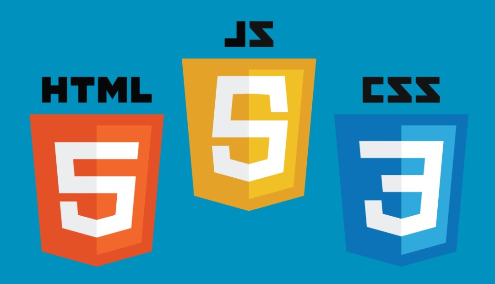

<!--  -->
<kbd></kbd>

    
# HTML-(HYPER TEXT MARKUP LANGUAGE )
 -  THIS IS MY **HTML** REPOSITORY WHERE YOU CAN FIND A 100's OF WEBPAGES AND MANY PROJECTS ALONG WITH THE HELP OF **CSS AND JAVASCRIPT**.

# LICENSE

## Authors

- [@Manmay Chakraborty](https://www.github.com/manmay2)

## 🚀 About Me
Hi, I am Manmay Chakraborty who is currently building up projects such as games,webpages,etc...on this repository.

## Feedback

If you have any feedback, feel free to reach out at manmaycoder@gmail.com

## 🛠 Skills
Javascript, HTML, CSS,C,C++,PYTHON and JAVA

